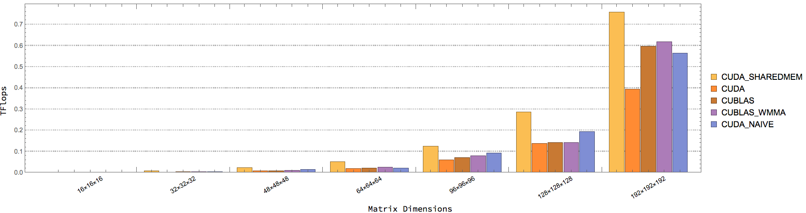
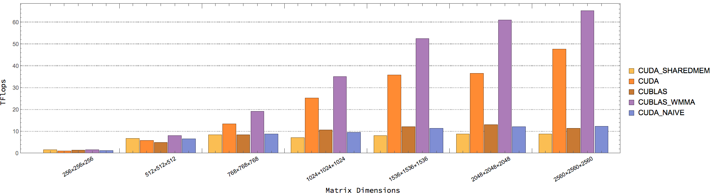
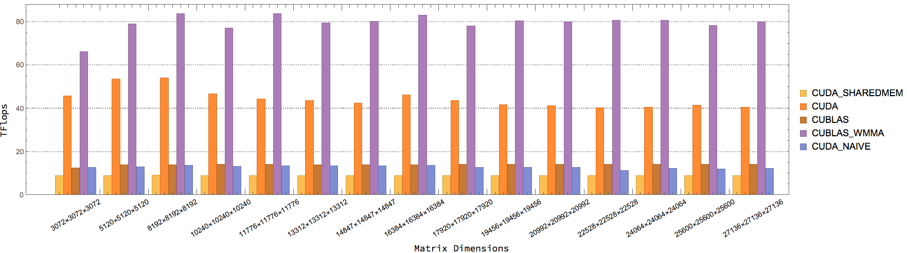
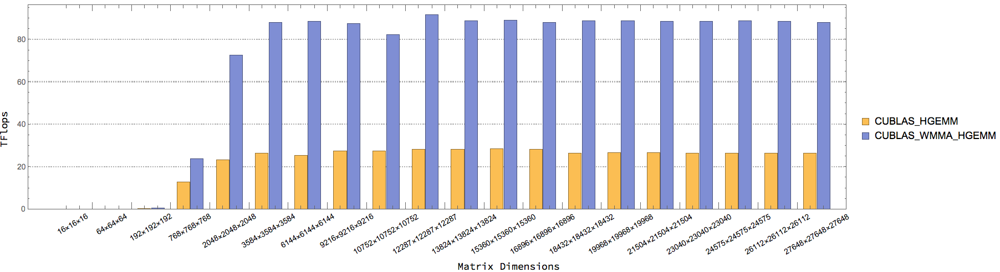
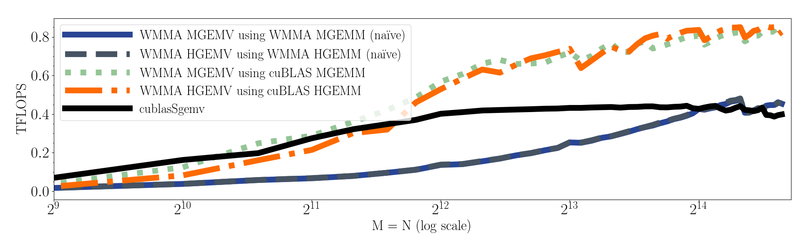
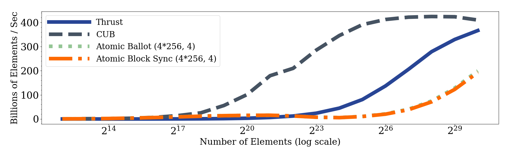

# TOPS: Tensor Ops

[](https://travis-ci.org/rai-project/tensorcore_bench)
[](https://circleci.com/gh/rai-project/tensorcore_bench)
[](https://app.netlify.com/start/deploy?repository=https://github.com/rai-project/tensorcore_bench)

## Installing latest cmake

cmake version >=3.8 is required.
(there's a problem with hunter using cmake 3.10.2)


      cd /tmp
      wget https://cmake.org/files/v3.10/cmake-3.10.1-Linux-x86_64.sh
      sudo sh cmake-3.10.1-Linux-x86_64.sh --prefix=/usr/local --exclude-subdir

you may also want to remove the default installation `sudo apt-get remove cmake`

you need to install from source if on ppc64le

## Checkout all submodules

```
git submodule update --init --recursive
```

or to update

```
git submodule update --recursive --remote
```

## Compile

To compile the project run the following commands

    mkdir -p build
    cd build
    cmake -DCMAKE_BUILD_TYPE=Release ..
    make

if you get errors about nvcc not supporting your gcc compiler, then you may want to use

    cmake -DCMAKE_BUILD_TYPE=Release -DCMAKE_CUDA_HOST_COMPILER=`which gcc-6` ..


## Available Benchmarks

The following benchmakrs are currently available

### [GEMM](src/gemm)

* [programming-tensor-cores-cuda-9](https://devblogs.nvidia.com/programming-tensor-cores-cuda-9/)

* [CUTLASS](https://devblogs.nvidia.com/cutlass-linear-algebra-cuda/)

* [cuBLAS](https://docs.nvidia.com/cuda/cublas/index.html#cublas-GemmEx)

| Name                                                   | Description                                                                 |
| ------------------------------------------------------ | --------------------------------------------------------------------------- |
| [CUBLAS_WMMA_GEMM](src/gemm/cublas.cu)                 | CUBLAS GEMM w/ Tensor Cores. AType, BType = half, CType = float             |
| [CUBLAS_GEMM](src/gemm/cublas.cu)                      | CUBLAS GEMM w/o Tensor Cores. AType, BType = half, CType = float            |
| [CUTLASS_WGEMM](src/gemm/cutlass.cu)                   | CUTLASS GEMM w/ Tensor Cores. AType, BType = half, CType = float            |
| [CUDA_WMMA_GEMM_NAIVE](src/gemm/wmma_naive.cu)         | Naive CUDA GEMM w/ Tensor Cores. AType, BType = half, CType = float         |
| [CUDA_WMMA_GEMM_SHAREDMEM](src/gemm/wmma_sharedmem.cu) | Shared memory CUDA GEMM w/ Tensor Cores. Atype, BType = half, CType = float |
| [CUDA_WMMA_GEMM](src/gemm/wmma.cu)                     | Optimized CUDA GEMM (from CUDA Samples). AType, BType = half, CType = float |

#### Comparision





### [HGEMM](src/gemm)

* [cublasHgemm](https://docs.nvidia.com/cuda/cublas/index.html#cublas-lt-t-gt-gemm)

| Name                                    | Description                                                       |
| --------------------------------------- | ----------------------------------------------------------------- |
| [CUBLAS_WMMA_HGEMM](src/gemm/cublas.cu) | CUBLAS HGEMM w/ Tensor Cores. AType, BType = half, CType = half   |
| [CUBLAS_HGEMM](src/gemm/cublas.cu)      | CUBLAS HGEMM w/o Tensor Cores. AType,  BType = half, CType = half |

#### Comparision



### [GEMV](src/gemv)

| Name                                                   | Description                                                                                                                              |
| ------------------------------------------------------ | ---------------------------------------------------------------------------------------------------------------------------------------- |
| [CUBLAS_GEMV](src/gemv/cublas.cu)                      | [cublasSgemv](https://docs.nvidia.com/cuda/cublas/index.html#cublas-lt-t-gt-gemv) y = alpha * Ax + beta * y. AType, xType, yType = float |
| [CUDA_WMMA_GEMV_CUBLAS](src/gemv/wmma_cublas.cu)       | Use CUBLAS GEMM w/ Tensor Cores for GEMV. AType, xType = half,  yType = float                                                            |
| [CUDA_WMMA_GEMV_NAIVE](src/gemv/wmma_naive.cu)         | Use Naive CUDA GEMM w/ Tensor Cores for GEMV. AType, xType = half, yType = float                                                         |
| [CUDA_WMMA_GEMV_SHAREDMEM](src/gemv/wmma_sharedmem.cu) | Use Shared memory CUDA GEMM w/ Tensor Cores for GEMV. AType, xType = half, yType = float                                                 |

#### Comparision



### [PrefixSum](src/prefixsum)

inType = half, outType = half

### Segmented PrefixSum

| Name                                                                 | Description                                                                                                                      |
| -------------------------------------------------------------------- | -------------------------------------------------------------------------------------------------------------------------------- |
| [CUB_BLOCK_SEGMENTED_PREFIXSUM](src/prefixsum/seg_cub_block.cu)      | [cub::BlockScan](https://nvlabs.github.io/cub/classcub_1_1_block_scan.html). segment_size = THREADS_PER_BLOCK * ITEMS_PER_THREAD |
| [CUB_WARP_SEGMENTED_PREFIXSUM](src/prefixsum/seg_cub_warp.cu)        | [cub::WarpScan](https://nvlabs.github.io/cub/classcub_1_1_warp_scan.html). segment_size = LOGICAL_THREADS_PER_WARP               |
| [THRUST_SEGMENTED_PREFIXSUM](src/prefixsum/seg_thrust.cu)            | [thrust::inclusive_scan_by_key](https://thrust.github.io/doc/group__segmentedprefixsums.html), inType = half, outType = half     |
| [CUDA_WMMA_SEGMENTED_PREFIXSUM_16](src/prefixsum/seg_wmma_16.cu)     | use Tensor Cores. segment_size = 16. each warp calculates WMMA_TILES_PER_WARP * 16 segments                                      |
| [CUDA_WMMA_SEGMENTED_PREFIXSUM_16N](src/prefixsum/seg_wmma_16n.cu)   | use Tensor Cores. segment_size = 16n where n is a positive integer. each warp calculates 16 segment                              |
| [CUDA_WMMA_SEGMENTED_PREFIXSUM_256](src/prefixsum/seg_wmma_256.cu)   | use Tensor Cores. segment_size = 16. each warp calculates WMMA_TILES_PER_WARP segments                                           |
| [CUDA_WMMA_SEGMENTED_PREFIXSUM_256N](src/prefixsum/seg_wmma_256n.cu) | use Tensor Cores. segment_size = 256n where n is a positive integer. each warp calculates 1 segment                              |

#### WWMMA_TILES_PER_WARP and WARPS_PER_BLOCK tuning for CUDA_WMMA_SEGMENTED_PREFIXSUM_16 and CUDA_WMMA_SEGMENTED_PREFIXSUM_256

(WMMA_TILES_PER_WARP = 2, WARPS_PER_BLOCK = 4) is the best.


#### Comparision

")


### Full PrefixSum

| Name                                                                  | Description                                                                                                                                                                                                                                                           |
| --------------------------------------------------------------------- | --------------------------------------------------------------------------------------------------------------------------------------------------------------------------------------------------------------------------------------------------------------------- |
| [CUB_FULL_PREFIXSUM](src/prefixsum/cub.cu)                            | [cub::DeviceScan::ExclusiveSum](https://nvlabs.github.io/cub/structcub_1_1_device_scan.html). inType = half, outType = half                                                                                                                                           |
| [THRUST_FULL_PREFIXSUM](src/prefixsum/thrust.cu)                      | [thrust::inclusive_scan](https://thrust.github.io/doc/group__prefixsums.html). inType = half, outType = half                                                                                                                                                          |
| [CUDA_WMMA_FULL_PREFIXSUM_3KERS_256](src/prefixsum/wmma_3kers_256.cu) | use CUDA_WMMA_SEGMENTED_PREFIXSUM_256 as the first kernel and use [cub::DeviceScan::ExclusiveSum](https://nvlabs.github.io/cub/structcub_1_1_device_scan.html) for scanning the partial sums, the third kernel adds the partials sums. inType = half, outType = half  |
| [CUDA_WMMA_FULL_PREFIXSUM_3KERS](src/prefixsum/wmma_3kers.cu)         | use CUDA_WMMA_SEGMENTED_PREFIXSUM_256N as the first kernel and use [cub::DeviceScan::ExclusiveSum](https://nvlabs.github.io/cub/structcub_1_1_device_scan.html) for scanning the partial sums, the third kernel adds the partials sums. inType = half, outType = half |
| [CUDA_WMMA_FULL_PREFIXSUM_CG](src/prefixsum/wmma_cg.cu)               | one kernel. use cooperative groups grid sysnchrozation to scan the partial sums. inType = half, outType = half                                                                                                                                                        |

Note: There's a bug in cub::WarpScan for LOGICAL_THREADS_PER_WARP = 16.

#### Comparision


### [Reduction](src/reduction)

### Segmented Reduction

| Name                                                                 | Description                                                                                                                          |
| -------------------------------------------------------------------- | ------------------------------------------------------------------------------------------------------------------------------------ |
| [CUB_BLOCK_SEGMENTED_REDUCTION](src/reduction/seg_cub_block.cu)      | [cub::BlockReduce](https://nvlabs.github.io/cub/classcub_1_1_block_reduce.html). segment_size = THREADS_PER_BLOCK * ITEMS_PER_THREAD |
| [CUB_DEVICE_SEGMENTED_REDUCTION](src/reduction/seg_cub_device.cu)    | [cub::DeviceSegmentedReduce::Sum](https://nvlabs.github.io/cub/structcub_1_1_device_segmented_reduce.html)                           |
| [THRUST_SEGMENTED_REDUCTION](src/reduction/seg_thrust.cu)            | [thrust::reduce_by_key](https://thrust.github.io/doc/group__reductions.html)                                                         |
| [CUDA_WMMA_SEGMENTED_REDUCTION_16](src/reduction/seg_wmma_16.cu)     | use Tensor Cores. segment_size = 16. each warp calculates WMMA_TILES_PER_WARP * 16 segments                                          |
| [CUDA_WMMA_SEGMENTED_REDUCTION_16N](src/reduction/seg_wmma_16n.cu)   | use Tensor Cores. segment_size = 16n where n is a positive integer. each warp calculates 16 segment                                  |
| [CUDA_WMMA_SEGMENTED_REDUCTION_256](src/reduction/seg_wmma_256.cu)   | use Tensor Cores. segment_size = 16. each warp calculates WMMA_TILES_PER_WARP segments                                               |
| [CUDA_WMMA_SEGMENTED_REDUCTION_256N](src/reduction/seg_wmma_256n.cu) | use Tensor Cores. segment_size = 256n where n is a positive integer. each warp calculates 1 segment                                  |

#### WWMMA_TILES_PER_WARP and WARPS_PER_BLOCK tuning for CUDA_WMMA_SEGMENTED_REDUCTION_16 and CUDA_WMMA_SEGMENTED_REDUCTION_256

(WMMA_TILES_PER_WARP = 1, WARPS_PER_BLOCK = 8) is the best.

#### Comparision

")
")
")

### Full Reduction

| Name                                                                            | Description                                                                                                                                                                                                                                |
| ------------------------------------------------------------------------------- | ------------------------------------------------------------------------------------------------------------------------------------------------------------------------------------------------------------------------------------------ |
| [CUB_FULL_REDUCTION](src/reduction/cub.cu)                                      | [cub::DeviceReduce::Sum](https://nvlabs.github.io/cub/structcub_1_1_device_reduce.html). inType = half, outType = half                                                                                                                     |
| [THRUST_FULL_REDUCTION](src/reduction/thrust.cu)                                | [thrust::reduce](https://thrust.github.io/doc/group__reductions.html). inType = half, outType = half                                                                                                                                       |
| [CUDA_WMMA_FULL_REDUCTION_2KERS](src/reduction/wmma_2kers.cu)                   | use CUDA_WMMA_SEGMENTED_REDUCTION_256N as the first kernel and use [cub::DeviceSegmentedReduce::Sum](https://nvlabs.github.io/cub/structcub_1_1_device_segmented_reduce.html) for reducing the all segments. inType = half, outType = half |
| [CUDA_WMMA_FULL_REDUCTION_CG](src/reduction/wmma_cg.cu)                         | one kernel. use cooperative groups grid sysnchrozation. inType = half, outType = half                                                                                                                                                      |
| [CUDA_WMMA_FULL_REDUCTION_ATOMIC_W_BLOCK_SYNC](src/reduction/wmma_atomic.cu)    | one kernel. use atomicAdd with block synchronization. inType = half, outType = half                                                                                                                                                        |
| [CUDA_WMMA_FULL_REDUCTION_ATOMIC_W_ATOMIC_BALLOT](src/reduction/wmma_atomic.cu) | one kernel. use atomicAdd with ballot. inType = half, outType = half                                                                                                                                                                       |

#### Comparision



### [Trigonometric](src/trigonometric)

#### Comparision

## Running Individual Benchmarks

you can benchmark each primitive individually using

    ./bench --benchmark_filter=[name_of_primitive]

for example

    ./bench --benchmark_filter=WMMA_GEMM

futher controls over the benchmarks are explained in the `--help` option

## Benchmark all the primitives

    ./bench

The above will output to stdout somthing like

    ------------------------------------------------------------------------------
    Benchmark                       Time           CPU Iterations UserCounters...
    ------------------------------------------------------------------------------
    SGEMM/1000/1/1/-1/1             5 us          5 us     126475 K=1 M=1000 N=1 alpha=-1 beta=1
    SGEMM/128/169/1728/1/0        539 us        534 us       1314 K=1.728k M=128 N=169 alpha=1 beta=0
    SGEMM/128/729/1200/1/0       1042 us       1035 us        689 K=1.2k M=128 N=729 alpha=1 beta=0
    SGEMM/192/169/1728/1/0        729 us        724 us        869 K=1.728k M=192 N=169 alpha=1 beta=0
    SGEMM/256/169/1/1/1             9 us          9 us      75928 K=1 M=256 N=169 alpha=1 beta=1
    SGEMM/256/729/1/1/1            35 us         35 us      20285 K=1 M=256 N=729 alpha=1 beta=1
    SGEMM/384/169/1/1/1            18 us         18 us      45886 K=1 M=384 N=169 alpha=1 beta=1
    SGEMM/384/169/2304/1/0       2475 us       2412 us        327 K=2.304k M=384 N=169 alpha=1 beta=0
    SGEMM/50/1000/1/1/1            10 us         10 us      73312 K=1 M=50 N=1000 alpha=1 beta=1
    SGEMM/50/1000/4096/1/0       6364 us       5803 us        100 K=4.096k M=50 N=1000 alpha=1 beta=0
    SGEMM/50/4096/1/1/1            46 us         45 us      13491 K=1 M=50 N=4.096k alpha=1 beta=1
    SGEMM/50/4096/4096/1/0      29223 us      26913 us         20 K=4.096k M=50 N=4.096k alpha=1 beta=0
    SGEMM/50/4096/9216/1/0      55410 us      55181 us         10 K=9.216k M=50 N=4.096k alpha=1 beta=0
    SGEMM/96/3025/1/1/1            55 us         51 us      14408 K=1 M=96 N=3.025k alpha=1 beta=1
    SGEMM/96/3025/363/1/0        1313 us       1295 us        570 K=363 M=96 N=3.025k alpha=1 beta=0

Output as JSON using

    ./bench --benchmark_out_format=json --benchmark_out=test.json

or preferably


    ./bench --benchmark_out_format=json --benchmark_out=`hostname`.json

## On Minsky With PowerAI


    mkdir -p build && cd build && rm -fr * && cmake -DCMAKE_BUILD_TYPE=Release ..


## Disable CPU frequency scaling

If you see this error:

```
***WARNING*** CPU scaling is enabled, the benchmark real time measurements may be noisy and will incur extra overhead.
```

you might want to disable the CPU frequency scaling while running the benchmark:

```bash
sudo cpupower frequency-set --governor performance
./mybench
sudo cpupower frequency-set --governor powersave
```

## Create Figures

```
python plot/plot.py plot/spec/full_reduction.yml
```

or generate all figures

```
python plot/plot.py all
```

## Run with Docker

Install `nvidia-docker`, then, list the available benchmarks.

    nvidia-docker run  --rm raiproject/tensorcore_bench:latest bench --benchmark_list_tests

You can run benchmarks in the following way (probably with the `--benchmark_filter` flag).

    nvidia-docker run --privileged --rm -v `readlink -f .`:/data -u `id -u`:`id -g` raiproject/tensorcore_bench:amd64-latest ./run_benchmarks.sh


* `--privileged` is needed to set the NUMA policy for NUMA benchmarks.
* `` -v `readlink -f .`:/data `` maps the current directory into the container as `/data`.
* `` --benchmark_out=/data/\`hostname`.json `` tells the `bench` binary to write out to `/data`, which is mapped to the current directory.
* `` -u `id -u`:`id -g` `` tells docker to run as user `id -u` and group `id -g`, which is the current user and group. This means that files that docker produces will be modifiable from the host system without root permission.


## Resources


### Atomic Half

[tensorflow](https://github.com/tensorflow/tensorflow/blob/faff6f2a60a01dba57cf3a3ab832279dbe174798/tensorflow/core/util/cuda_device_functions.h#L435-L474)

